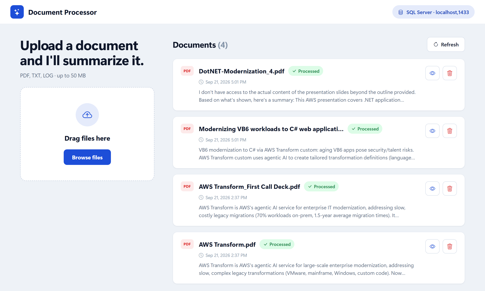
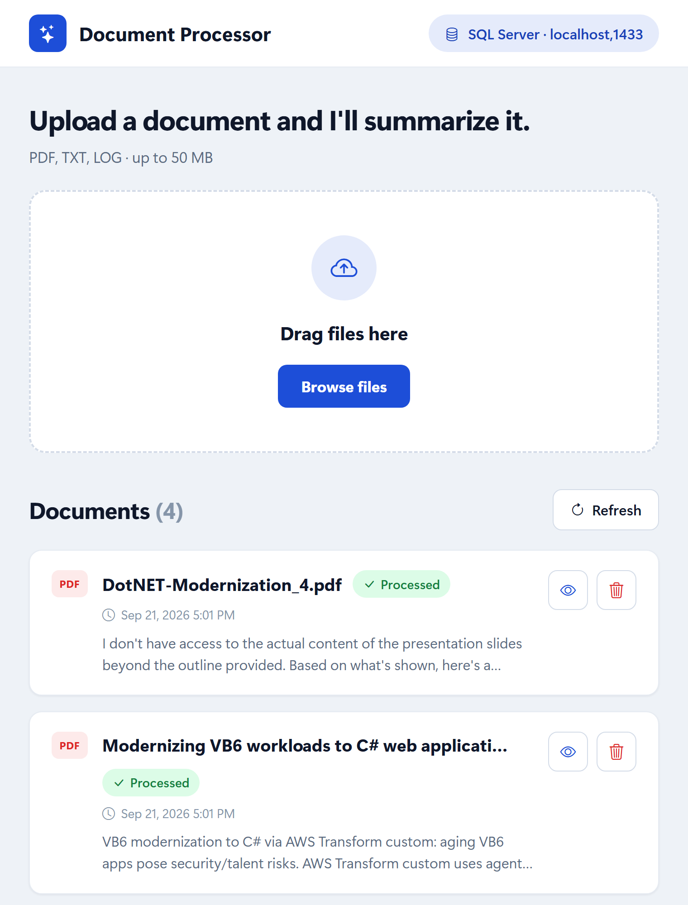

# 📄 Document Processing System

A streamlined document processing application built with .NET 10 Blazor Server that leverages AWS Bedrock AI for intelligent document analysis and summarization.



## 🌟 Key Features

- **🤖 AI-Powered Processing**: Integration with AWS Bedrock (Claude 3.7 Sonnet) for intelligent document summarization
- **📁 Multi-Format Support**: Process PDF documents with text extraction
- **📤 Easy Upload**: Drag-and-drop interface for document uploads
- **☁️ Flexible Storage**: Support for both AWS S3 and local file storage
- **🔐 Secure Credentials**: AWS Secrets Manager integration for database connection strings
- **💾 Database Support**: Microsoft SQL Server via Entity Framework Core
- **📊 Document Management**: Track upload status, view summaries, and manage documents
- **🔄 Status Tracking**: Real-time processing status (Pending, Processing, Processed, Failed)

## 🏗️ Architecture

Simple single-project Blazor Server architecture:

```
DPS/
└── src/
    └── DocumentProcessor.Web/
        ├── Components/        # Blazor components and pages
        ├── Data/             # DbContext and database configuration
        ├── Models/           # Document entity and enums
        ├── Services/         # Business logic (AI, Storage, Processing)
        └── wwwroot/          # Static files (CSS, images)
```

## 🚀 Getting Started

### Prerequisites

- .NET 10.0 SDK or later
- Docker (to run SQL Server locally) or an existing SQL Server instance
- AWS Account with:
  - Bedrock access (Claude 3.7 Sonnet model)
  - S3 bucket (optional, for cloud storage)
  - Secrets Manager (for database credentials)
- AWS CLI configured with appropriate credentials

### Installation

1. **Clone the repository**
   ```bash
   git clone https://github.com/aws-samples/sample-document-processing-system.git
   cd .\sample-document-processing-system\  
   ```

2. **Configure AWS Credentials**

   Ensure your AWS credentials are configured:
   ```bash
   aws configure
   ```

   Or set environment variables:
   ```bash
   export AWS_ACCESS_KEY_ID=your_access_key
   export AWS_SECRET_ACCESS_KEY=your_secret_key
   export AWS_DEFAULT_REGION=us-east-1
   ```

3. **Start SQL Server in Docker**

   The app talks to SQL Server. The included Compose file runs it locally:
   ```bash
   docker compose up -d
   ```

   This starts `mcr.microsoft.com/mssql/server:2022-latest` on port 1433 with the `sa`
   password `LocalDev!Passw0rd`, matching the default connection string in
   `appsettings.json`. Override it by setting `MSSQL_SA_PASSWORD` before `docker compose up`
   (update the connection string to match). Data persists in the `sqlserver-data` volume.

   The app calls `EnsureCreatedAsync()` at startup, so the `DPS` database and `Documents`
   table are created automatically on first run — no migration step needed.

4. **Configure Application Settings** (Optional)

   `src/DocumentProcessor.Web/appsettings.json` points at the Docker instance by default:
   ```json
   {
     "ConnectionStrings": {
       "DefaultConnection": "Server=localhost,1433;Database=DPS;User Id=sa;Password=LocalDev!Passw0rd;TrustServerCertificate=true;MultipleActiveResultSets=true"
     },
     "Database": {
       "UseSecretsManager": false
     }
   }
   ```

   To use an RDS SQL Server instance instead of Docker, set `Database:UseSecretsManager` to
   `true` and create a Secrets Manager secret with the description
   `Password for RDS MSSQL used for MAM319.`:
   ```json
   {
     "username": "your_username",
     "password": "your_password",
     "host": "your-db-host.rds.amazonaws.com",
     "port": "1433",
     "dbname": "your_database_name"
   }
   ```
   If the lookup fails, the app logs a warning and falls back to `DefaultConnection`.

5. **Run the application**
   ```bash
   cd src/DocumentProcessor.Web
   dotnet run
   ```

6. **Access the application**

   Navigate to `http://localhost:5197`

## 📋 Features Overview

### Document Upload & Processing



- **Drag-and-drop Interface**: Easy file upload with visual feedback
- **PDF Text Extraction**: Automatic text extraction using PdfPig
- **AI Summarization**: Generate intelligent summaries using AWS Bedrock
- **Document Classification**: Categorize documents automatically
- **Status Tracking**: Monitor document processing status in real-time

### Storage Options

The application supports two storage backends:

1. **Local File System**: Documents stored in `uploads/` directory
2. **AWS S3**: Cloud storage with automatic bucket management

Storage is configured automatically based on AWS credentials availability.

### Database

- **SQL Server**: The only supported provider, via Entity Framework Core
- **Local Development**: SQL Server 2022 in Docker (see `docker-compose.yml`)
- **Automatic Creation**: Database schema created automatically on first run

## 🛠️ Technology Stack

- **Backend**:
  - .NET 10 with C# 14
  - ASP.NET Core Blazor Server
  - Entity Framework Core 10

- **Frontend**:
  - Blazor Server-Side Rendering
  - Bootstrap 5 for responsive UI
  - Custom CSS for styling

- **Database**:
  - Microsoft SQL Server (EntityFrameworkCore.SqlServer 10.0.12)
  - SQL Server 2022 in Docker for local development

- **Cloud Services**:
  - AWS Bedrock (Claude 3.7 Sonnet for AI processing)
  - AWS S3 (Document storage)
  - AWS Secrets Manager (Credential management)

- **Document Processing**:
  - PdfPig 0.1.11 (PDF text extraction)
  - CsvHelper 33.1.0 (CSV processing)

## 📁 Project Structure

```
src/DocumentProcessor.Web/
├── Components/
│   ├── Layout/
│   │   ├── MainLayout.razor       # Main app layout
│   │   └── NavMenu.razor          # Navigation menu
│   └── Pages/
│       └── Home.razor             # Main page with upload and document list
├── Data/
│   └── AppDbContext.cs            # Entity Framework DbContext
├── Models/
│   └── Document.cs                # Document entity with status enum
├── Services/
│   ├── AIService.cs               # AWS Bedrock integration
│   ├── DatabaseInfoService.cs    # Database metadata
│   ├── DocumentProcessingService.cs  # Document processing logic
│   ├── FileStorageService.cs     # S3/local file storage
│   └── SecretsService.cs         # AWS Secrets Manager
├── wwwroot/
│   └── css/
│       └── app.css                # Custom styles
└── Program.cs                     # App configuration and startup
```

## 🔧 Configuration

### AWS Bedrock Model

The application uses Claude 3.7 Sonnet v2 by default:
- Model ID: `us.anthropic.claude-3-7-sonnet-20250219-v1:0`
- Region: Configured via AWS CLI or environment variables
- Max Tokens: 1024 for summaries

### File Storage

**Local Storage** (default fallback):
```
DocumentProcessor.Web/uploads/
```

**AWS S3 Storage**:
- Bucket: `document-processor-uploads-{accountId}`
- Auto-created if it doesn't exist
- Files organized by document ID

### Database Connection

The app resolves its SQL Server connection string as follows:
1. `ConnectionStrings:DefaultConnection` from appsettings.json (points at Docker by default)
2. If `Database:UseSecretsManager` is `true`, AWS Secrets Manager (SQL Server secret with
   the "MAM319" description) overrides it; on failure it falls back to step 1

## 🔒 Security Features

- **AWS Secrets Manager**: Database credentials never stored in code
- **Secure File Storage**: Documents stored with unique GUIDs
- **Input Validation**: File type and size validation
- **SQL Injection Prevention**: Parameterized queries via EF Core
- **XSS Protection**: Built-in Blazor security features
- **Soft Deletes**: Documents marked as deleted, not physically removed

## 📊 Document Status States

Documents progress through the following states:

1. **Pending**: Uploaded, waiting for processing
2. **Processing**: Currently being analyzed by AI
3. **Processed**: Successfully processed with summary available
4. **Failed**: Processing encountered an error

## 🚢 Deployment

### AWS Deployment

The application is designed for AWS deployment:

1. **Database**: RDS for SQL Server
2. **Storage**: S3 for document files
3. **Compute**: Elastic Beanstalk, ECS, or EC2
4. **Credentials**: Secrets Manager for sensitive data

### Docker

`docker-compose.yml` runs SQL Server 2022 for local development. The web app itself still
runs on the host via `dotnet run`; containerizing it would need a standard .NET 10 Dockerfile.

## 🆘 Troubleshooting

### Database Connection Issues

If you see database connection errors:
1. Verify AWS Secrets Manager secrets are configured correctly
2. Check AWS credentials have permissions to access Secrets Manager
3. Fallback to local connection string in appsettings.json

### AWS Bedrock Access

If AI processing fails:
1. Verify AWS region supports Bedrock
2. Check IAM permissions include Bedrock access
3. Ensure Claude model access is enabled in AWS console

### File Upload Issues

If uploads fail:
1. Check file size and format (PDF supported)
2. Verify local uploads directory exists and is writable
3. For S3: confirm S3 bucket permissions and AWS credentials

## 🗺️ Roadmap

### Planned Features
- Support for additional document formats (DOCX, TXT, images)
- Batch document processing
- Document search and filtering
- Export capabilities
- User authentication
- Document versioning
- Advanced AI analysis options

## 🤝 Contributing

Contributions are welcome! Please feel free to submit a Pull Request.

1. Fork the repository
2. Create your feature branch (`git checkout -b feature/AmazingFeature`)
3. Commit your changes (`git commit -m 'Add some AmazingFeature'`)
4. Push to the branch (`git push origin feature/AmazingFeature`)
5. Open a Pull Request

## 📝 License

This project is licensed under the MIT License.

## 🙏 Acknowledgments

- Built with [.NET 10](https://dotnet.microsoft.com/)
- AI powered by [AWS Bedrock](https://aws.amazon.com/bedrock/)
- UI framework by [Bootstrap](https://getbootstrap.com/)
- PDF processing by [PdfPig](https://github.com/UglyToad/PdfPig)

---

**Built with ❤️ using .NET 10 and AWS Bedrock AI**
